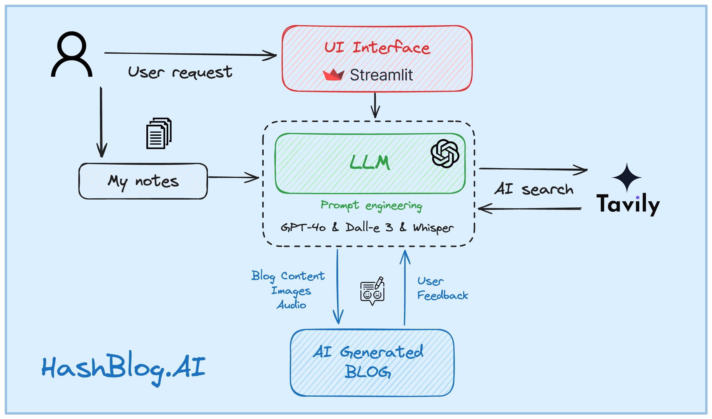

# HashBlogs.AI #️⃣

HashBlogs.AI is your super-smart AI assistant for blogging! Just specify your preferences, and watch as it crawls live information 🌐, formats your content 📝, and adds engaging images 🖼️ like magic! ✨

## How its built 🛠️



## Run The Application ⚙️
1. Clone the repo
```
git clone https://github.com/SSK-14/HashBlogs.AI.git
```

2. Install required libraries

- Create virtual environment
```
pip3 install virtualenv
python3 -m venv {your-venvname}
source {your-venvname}/bin/activate
```

- Install required libraries
```
pip3 install -r requirements.txt
```

- Activate your virtual environment
```
source {your-venvname}/bin/activate
```

3. Set up your `secrets.toml` file
- Copy `example.secrets.toml` into `secrets.toml` and replace the keys

4. Running
```
streamlit run app.py 
```

## Contributing 🤝
Contributions to this project are welcome! If you find any issues or have suggestions for improvement, please open an issue or submit a pull request on the project's GitHub repository.

## License 📝
This project is licensed under the [MIT License](https://github.com/SSK-14/HashBlogs.AI/blob/main/LICENSE). Feel free to use, modify, and distribute the code as per the terms of the license.